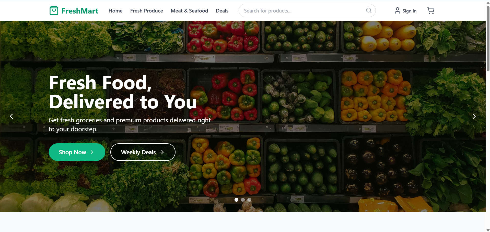
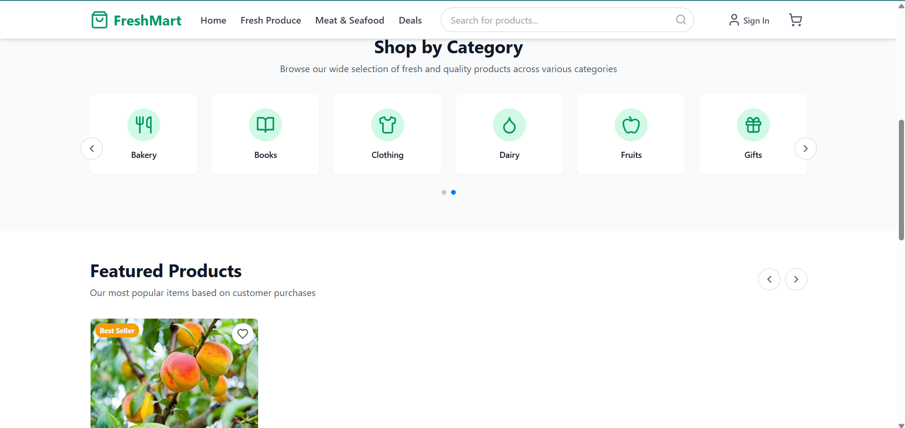
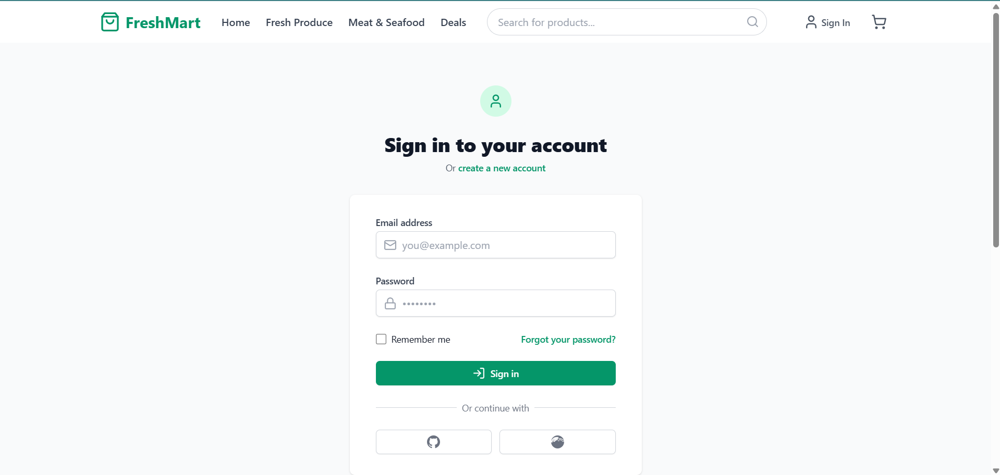
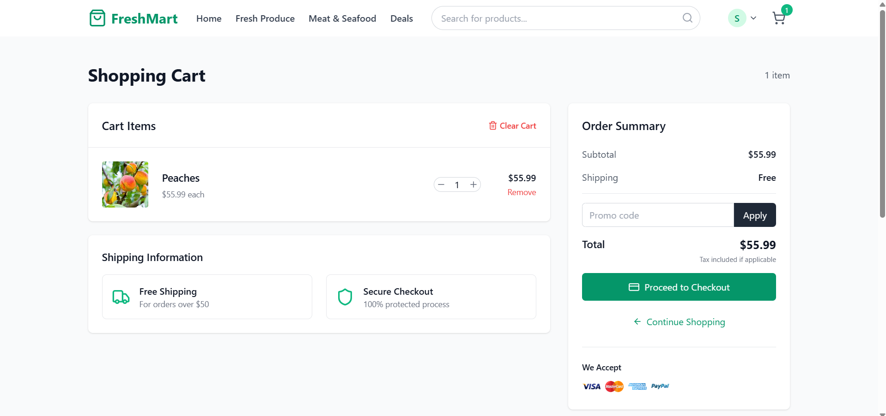
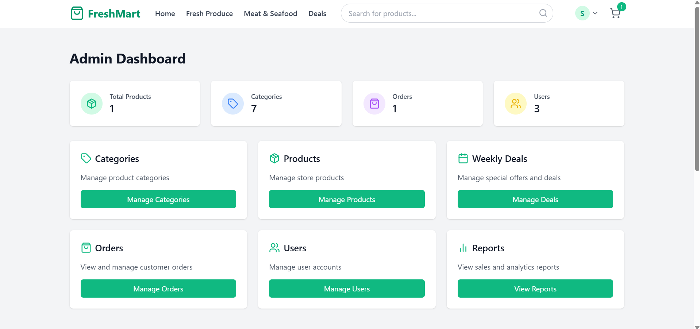
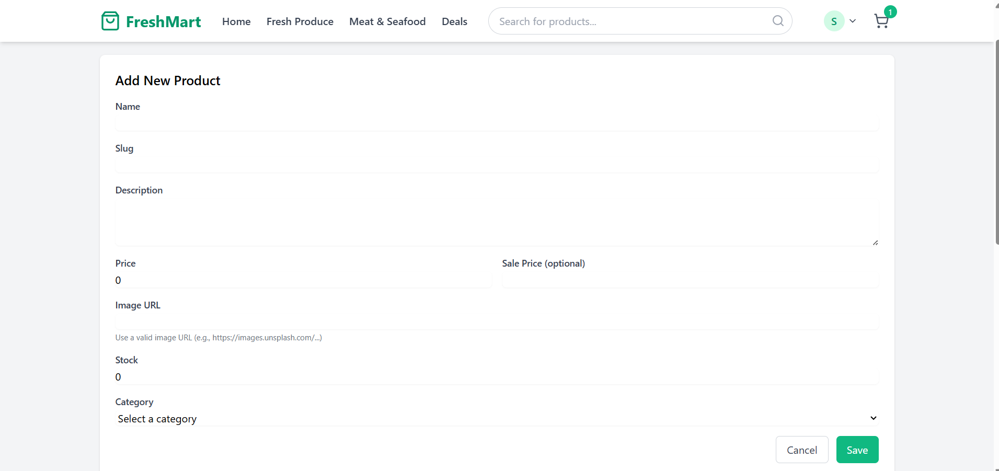
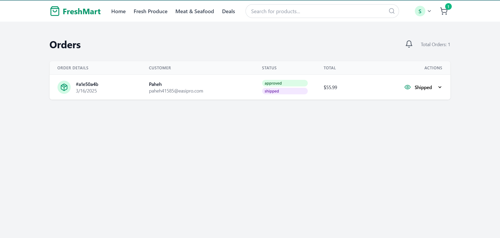

# FreshMart Project

## Project Overview
FreshMart is a comprehensive web application designed to streamline supermarket management and provide an efficient shopping experience.

## Features
- User-friendly interface
- Product catalog management
- Shopping cart functionality
- Inventory tracking
- Sales reporting

## Deployment
The application is live and can be accessed at:
- **Live Preview**: [https://bright-quokka-dabc84.netlify.app/]
- **Deployment Platform**: Netlify      

## For using clone the application 
- # add the .env file content (as I used the supabase check the supabase content)
- # next add all the migrations file in supabase directory
- # than do npm install
- # now the application is ready run your application using npm run dev 

## Now for the admin pannel 
### please add the first admin directly from the supabase database changing the role from user to admin 
### after that the admin can give access to different other users 

### to add the image use of image url is better than using the image itself as it makes the page lagging 
    

### order details shown here
